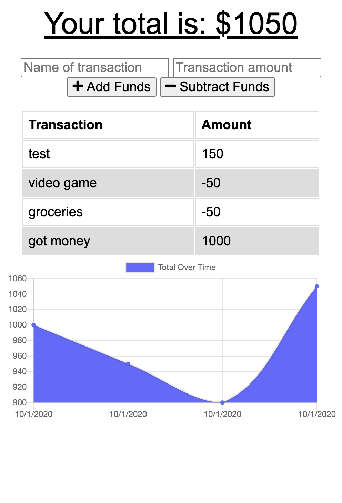

# Budget-Tracker-PWA-

## Description
The Budget Tracker App allows users to log their deposits and withdraws and correspondingly generates a transcation history chart. This application is a Progressive Web App, meaning that the user is able to download the application onto their homescreen and continue to log transactions while offline. These transcations will be recorded into the database once network is again available.

## Deployed Link on Heroku:
https://budget-tracker-application.herokuapp.com/

## Development
In this application I was able to take exisitng client side code and develop a functional backend based on what is given. My roles include:

- establish a server and html, api routes
- create a manifest and a service-worker to make the application a PWA
- store data within a indexedDB object store while offline
- deploy on heroku